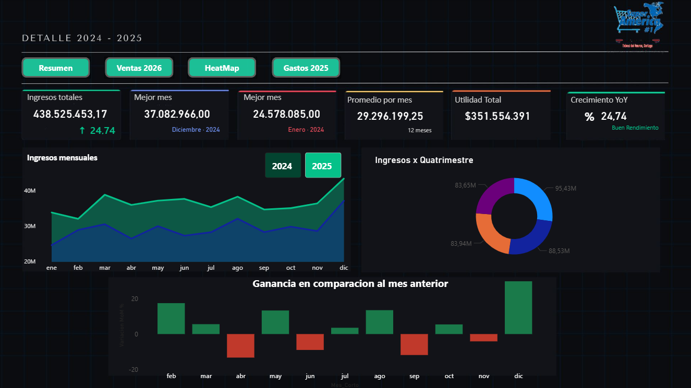
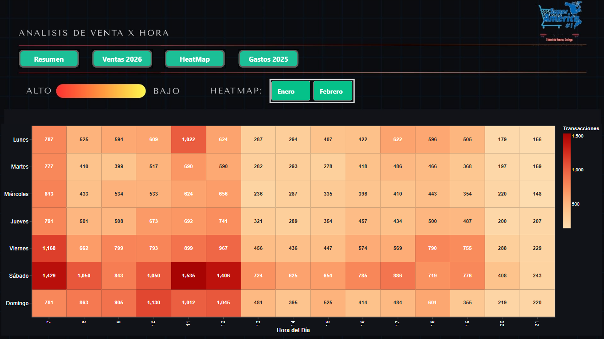
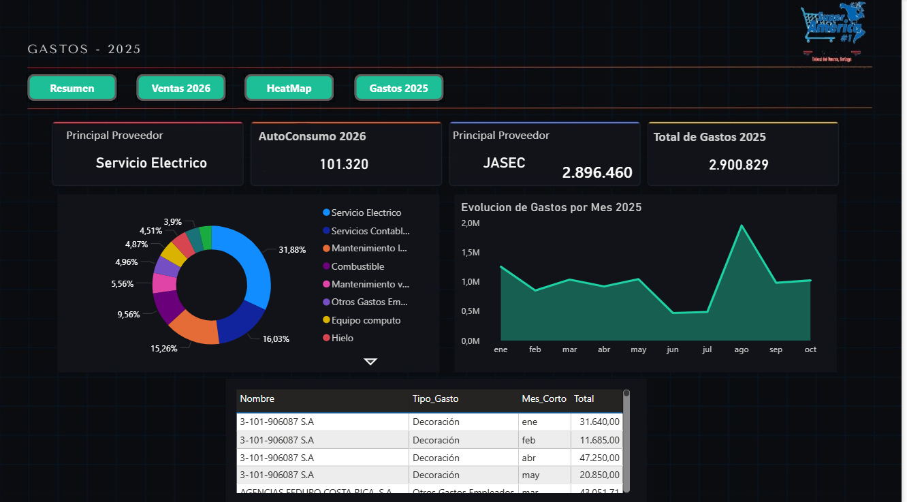
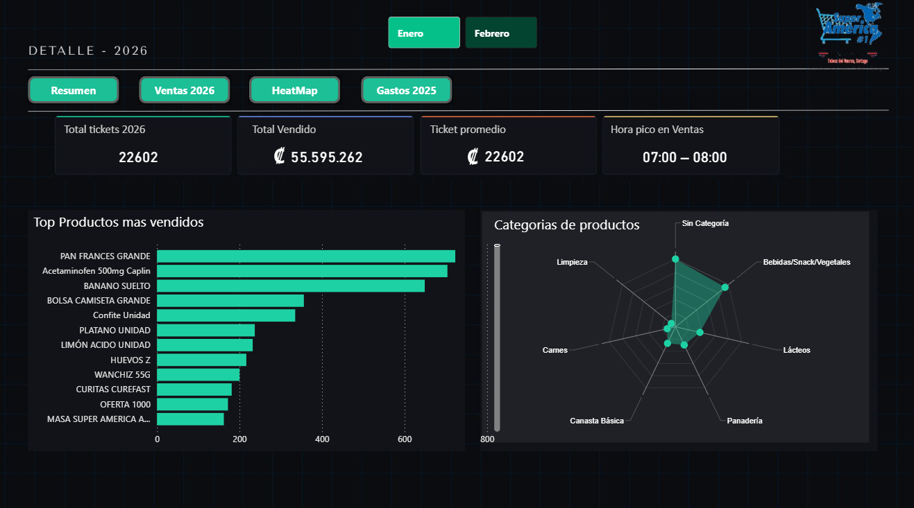

# Supermercado Analysis Project

Análisis de datos de un supermercado con visualizaciones, reportes y dashboard interactivo.



## Descripción del Proyecto

Este proyecto contiene el análisis completo de datos de ventas de un supermercado, incluyendo:

- **Análisis de ventas** por día y hora
- **Clasificación de productos** por categorías
- **Dashboard interactivo** en Power BI
- **Reportes automatizados** en Python

## Estructura del Proyecto

```
Supermercado git/
├── Dashboard/          # Power BI dashboard y recursos
│   ├── Media/          # Imágenes del dashboard
│   └── dahboard2026.pbix
├── datos/              # Datos de ventas (Enero, Febrero)
├── datosCrudos/        # Datos crudos originales
├── documentos/         # Documentos de conclusiones
├── Python/             # Scripts de análisis
│   └── reportes/       # Visualizaciones generadas
├── portada.png         # Portada del dashboard
├── heatmap.png         # Heatmap de ventas por hora/día
├── gastos2025.png      # Análisis de gastos 2025
└── detalle 2026.png    # Detalle de 2026
```

## Imágenes del Repositorio

### Heatmap de Ventas por Hora/Día



### Gastos 2025



### Detalle 2026



## Tech Stack

- **Python**: Análisis de datos con pandas, matplotlib
- **Power BI**: Dashboard interactivo
- **Git**: Control de versiones

## Cómo se Usó IA para Crear Este Proyecto

Este proyecto fue desarrollado con asistencia de inteligencia artificial:

- **Análisis de datos**: Asistencia en Scripts de Python previamente construidos para procesamiento y visualización
- **Documentación**: Creación automática de estructura y READMEs

## Getting Started

1. Clone el repositorio
2. Instale las dependencias de Python: `pip install pandas matplotlib openpyxl`
3. Ejecute los scripts en la carpeta `Python/`
4. Abra el dashboard en `Dashboard/dahboard2026.pbix`

## Licencia

Este proyecto es para fines de análisis y portafolio.
Tengo Permiso del supermercado para subir esto!
